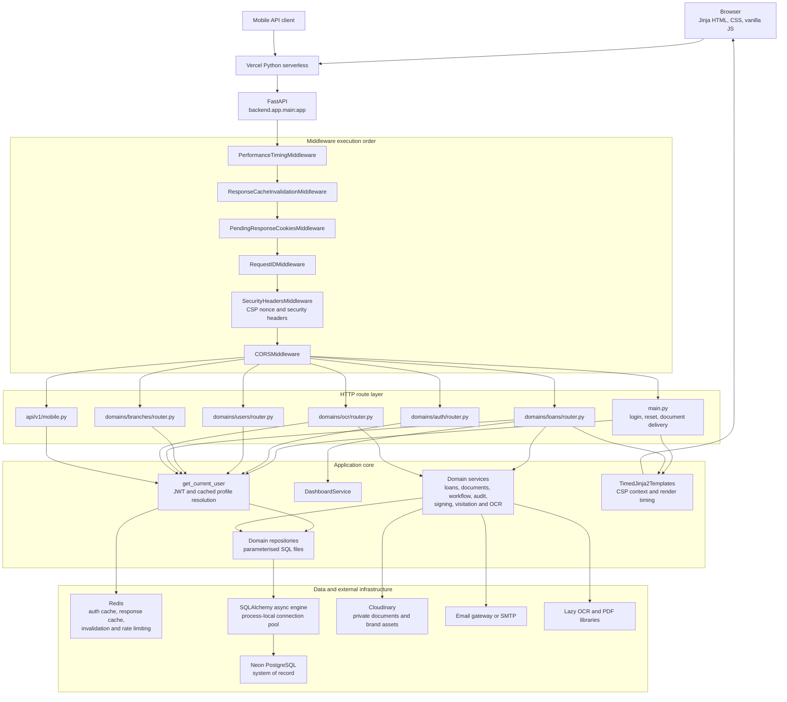

# FieldCRM current component map

Last repository inspection: 30 July 2026.

## Purpose and notation

This is a C4-style component view expressed as a Mermaid flowchart. It is
architecture model-as-code rather than formal UML. It answers one question:
which runtime components participate in a FieldCRM request, and where are the
principal data and external-service boundaries?

The source diagram is [`current-component-map.mmd`](current-component-map.mmd).
Markdown viewers with Mermaid support render the embedded copy below. A
standalone SVG can be generated from the source with Mermaid CLI.

## Component map

## Evidence

| Classification | Relationship | Repository evidence |
|---|---|---|
| Confirmed | Vercel entry point to FastAPI | `pyproject.toml` and `backend/app/main.py` |
| Confirmed | Middleware order | Registration in `backend/app/main.py`; Starlette executes the last registered middleware first |
| Confirmed | Route families | Router imports and `include_router` calls in `backend/app/main.py` |
| Confirmed | Authentication to Redis and PostgreSQL fallback | `backend/app/core/dependencies.py` and `backend/app/core/cache.py` |
| Confirmed | Repository to SQLAlchemy async engine | `backend/app/core/database.py` |
| Confirmed | Jinja rendering and CSP context | `backend/app/core/templates.py` and `backend/app/core/template_utils.py` |
| Confirmed | Cloudinary and email boundaries | `backend/app/services/cloud_storage_service.py` and `backend/app/services/email_service.py` |
| Confirmed | Lazy OCR/PDF imports | `backend/app/services/ocr_extraction_service.py` and `backend/app/services/pdf_service.py` |
| Unverified | Physical regions and network paths | Requires Vercel, Neon and Redis deployment configuration |

## Architecture audit

1. **High:** `backend/app/main.py` performs schema inspection during application
   startup and may execute `ALTER TABLE` or create `ocr_jobs`. This adds a
   database dependency to serverless cold start and puts schema mutation outside
   the migration lifecycle.
2. **Medium:** `backend/app/domains/loans/router.py` contains most rendered
   workflows and is the primary routing and change-impact concentration.
3. **Medium:** some page templates load `dashboard_legacy.css` in addition to
   shared shell styles, increasing frontend coupling and transferred CSS.
4. **Positive:** the database engine is process-scoped and pooled; it is not
   recreated for each request.
5. **Positive:** request, query, Redis and Jinja timings are instrumented.
6. **Positive:** CSP nonce handling is centralized in middleware and the shared
   Jinja context.

## Validation and maintenance

- Render the `.mmd` source with Mermaid CLI and keep the SVG beside it.
- Treat the `.mmd` file as the source of truth; do not hand-edit the SVG.
- Recheck middleware order whenever `add_middleware` calls change.
- Recheck routes whenever a router is added, removed or moved.
- Production geography remains unverified until deployment metadata is
  inspected; do not infer it from environment-variable names.
